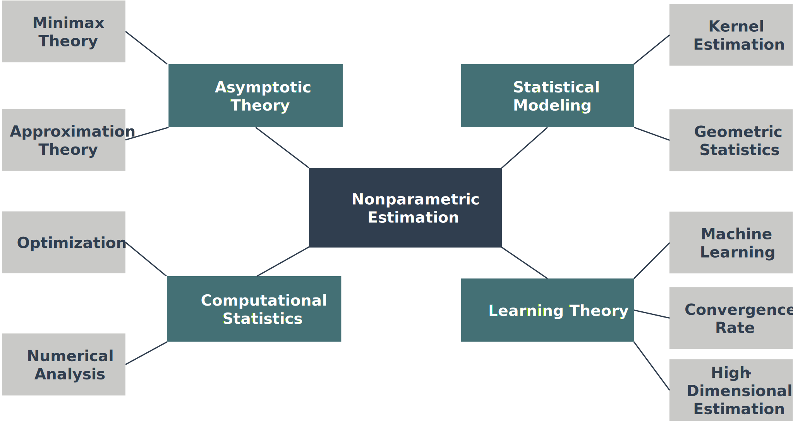

Welcome to the Infinite Dimensional Models & Inference Lab!

I am Kwan-Young Bak, leading this lab. Since March 2022, I have been working as an assistant professor at the School of Mathematics, Statistics, and Data Science at Sungshin Women’s University. I received my Ph.D. in Mathematical Statistics from Korea University in August 2021.

Our lab is primarily focused on developing methodologies and investigating the theoretical properties of infinite (or high) dimensional statistical models. To distinguish these from classical statistical models based on parametric assumptions, such approaches are often referred to as nonparametric models. Our agenda is to advance both the theoretical understanding and practical applications of infinite-dimensional models.

This website serves as a platform for collaboration and communication. Resources such as the complete list of publications and research projects, teaching materials, and references are always available upon request. If you have any questions, are interested in collaborative research, or wish to join our lab, please do not hesitate to reach out!

  <h3 class="my-heading">Research Interest</h3>
  
From my graduate studies, my primary interest from a statistical perspective has been in theoretical statistics and the development of novel methods. In particular, I have conducted various studies centered around minimax theory in the context of learning theory. My work actively explores the development and theoretical investigation of kernel learning methods grounded in reproducing kernel Hilbert space theory, as well as function estimation based on basis expansion using, for example, spline and wavelet functionss. Additionally, I have a strong interest in high-dimensional estimation problems and the development of penalization methodologies to address these challenges. The diagram below illustrates several of these research areas.

    

  

   
  
   

  In addition to research on statistical methodologies and theories, our lab actively engages in studies related to the application of these methods and data analysis. We work on a variety of projects leveraging data across diverse application domains, with a particular focus on a wide range of topics in biostatistics. This broad scope includes traditional areas such as survey research and experimental data analysis, as well as applications of nonparametric models. Moreover, we explore more modern fields like causal inference and data modeling based on deep learning / machine learning methods. In biostatistics, our research interests span various types of data, including survey data, panel data, clinical data, genomics data, radiological image data, healthcare system and policy-related data, environmental data, and public health data. We welcome inquiries regarding potential collaborations. Please feel free to contact us if you are interested in exploring research opportunities together.

  <h3 class="my-heading">Join Us</h3>
  
We are always looking for talented, motivated people to join us. If you are interested in the things we do and you would like to join us, or visit our lab, please contact Kwan-Young Bak (kybak@sungshin.ac.kr).

